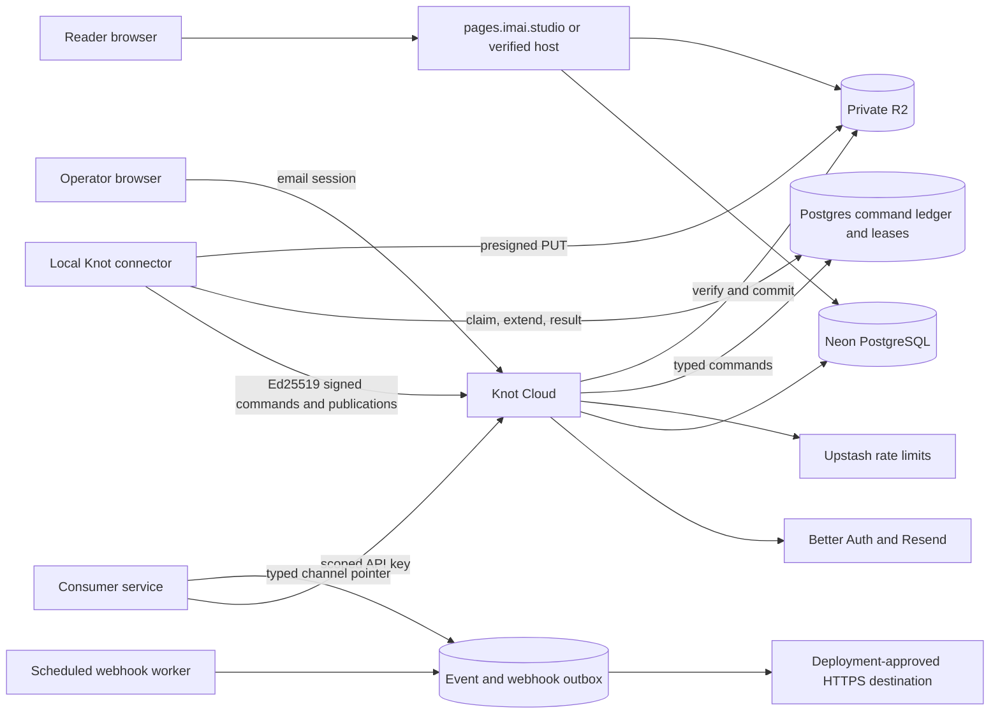

# Knot Cloud architecture

Knot Cloud coordinates work for local Knot installations. It does not grant an agent access to
Anytype or the operator's machine. Local Knot remains the authority for every Anytype operation.

## Deployed components

| Component              | Provider      | Role                                                          |
| ---------------------- | ------------- | ------------------------------------------------------------- |
| Web application        | Vercel        | Console, connector API, scheduled workers, and reader         |
| PostgreSQL             | Neon          | Authentication, tenant state, commands, leases, and audit log |
| Private object storage | Cloudflare R2 | Publication assets and immutable version bundles              |
| Rate limits            | Upstash Redis | Connector and pairing abuse limits                            |
| Email                  | Resend        | Passwordless sign-in links for allowed operators              |

The application uses the non-owning `knot_app` database role. Operators apply migrations with a
separate owner credential that never enters Vercel. The R2 bucket has no public URL. Knot accesses
it through the S3-compatible API with bucket-scoped credentials.

The managed control plane is `knot.imai.tech`. The fixed reader origin is
`pages.imai.studio`. Reader routes return `404` on the control host. Dashboard and control API routes
return `404` on the reader host.

## Request paths

## Connector and API authority

The connector generates an Ed25519 key and keeps the private key locally. Knot Cloud stores the
public key. Signed requests claim a unique Postgres nonce before a mutation proceeds. Commands use
random lease tokens and compare-and-set results, so a stale worker cannot finish a newer attempt.

Consumer API keys use a separate credential class. Each key has explicit Anytype scopes, connector
bindings, quotas, and optional expiry. The API accepts only the typed operation union. It does not
accept prompts, shell commands, file paths, arbitrary HTTP, or model tools. Cloud admission does
not bypass the connector's local policy.

Transactional event intake also uses a scoped consumer API key. An event stores only an Anytype
space, chat, and message pointer. A webhook recipient that asks local Knot to act must make Knot
fetch the native object and authorize its participant.

## Publishing and readers

Publication assets go directly from local Knot to a short-lived private R2 URL. The signed request
binds tenant, digest, byte size, kind, and media type. Knot reads the object back, verifies its exact
length and SHA-256, then permits a typed publication version to reference it.

Postgres stores publication pointers, tombstones, and the deletion outbox. Disable and unpublish
change database state first, so every page and media route returns `404` before physical deletion.
The scheduled worker then deletes version bundles and unshared assets from R2.

The reader renders only the versioned document schema. It does not accept authored HTML, scripts,
styles, embeds, or arbitrary URLs. Public and authenticated responses use `no-store`. Grant-backed
reader sessions are host-only, site-specific, `HttpOnly`, and `SameSite=Lax`. Revoking a grant also
revokes its reader sessions.

Knot verifies custom-domain ownership with an exact DNS TXT challenge. It does not edit DNS,
attach a domain to Vercel, or provision TLS. The operator owns those steps.

## Scheduled work

Vercel invokes two authenticated routes:

- Every ten minutes, `/api/internal/publications/maintenance` drains publication and asset
  deletion.
- Every minute, `/api/internal/webhooks/maintenance` processes a rotating, bounded window of due
  webhook deliveries.

Self-hosted operators must schedule both routes with the dedicated cron bearer secret. Postgres
holds the authoritative outbox state. A scheduler may start work but never holds the only copy.

## Disabled providers

Hosted connector execution, billing, and media transformation execution are disabled. The database
contains bounded configuration or job metadata for these areas, but the provider adapters reject
execution. A general S3-compatible object adapter also remains planned.

## Self-hosting boundary

The standalone Next.js image supports self-hosting. Self-hosters must keep the runtime database role
non-owning and subject to row-level security. Object storage stays private. Public content uses a
different registrable domain from the dashboard. Connector keys, API keys, cron credentials, and
human sessions stay separate.

See [`docs/implementation-roadmap.md`](docs/implementation-roadmap.md) for remaining work and
[`docs/releases.md`](docs/releases.md) for released behavior.
