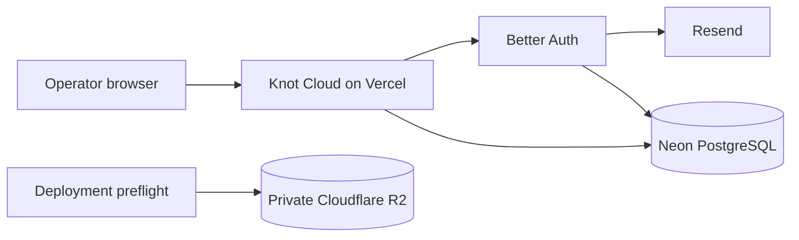
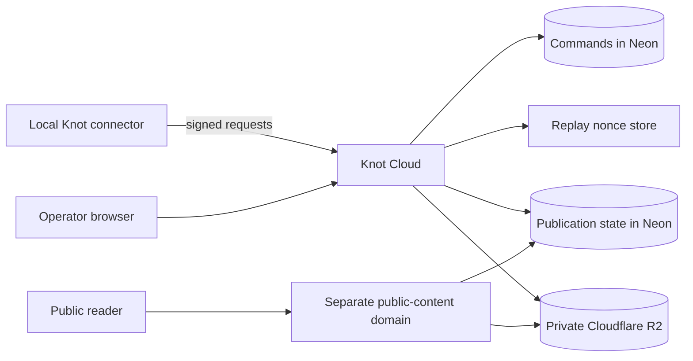

# Knot Cloud architecture

Knot Cloud coordinates work for local Knot installations. It does not grant an agent access to
Anytype or the operator's machine. The local Knot configuration remains the authority for every
operation.

## Deployed P0

The current production deployment has four services.

| Component              | Provider      | Released role                                                                                        |
| ---------------------- | ------------- | ---------------------------------------------------------------------------------------------------- |
| Web application        | Vercel        | Invitation-only login, operator console, `GET /api/health`, and `GET /api/v1/meta`                   |
| PostgreSQL             | Neon          | Better Auth tables, tenant schema, forced row-level security, and durable records for later releases |
| Private object storage | Cloudflare R2 | Deployment preflight and the tested immutable object-store adapter                                   |
| Email                  | Resend        | Passwordless sign-in links for allowed operator addresses                                            |

The web application uses the non-owning `knot_app` database role. Operators apply migrations with a
separate owner credential that never enters the Vercel environment. The R2 bucket is private. Knot
uses the AWS S3 client to read and write it, but the current adapter configures Cloudflare R2
directly. Vercel Blob is not part of this architecture.

P0 includes schemas, migrations, provider adapters, signing code, and tests for later releases.
That code does not create a public product API. There are no released routes for pairing a
connector, publishing a document, serving a public page, issuing an API key, or operating on Anytype
data.

## Current request paths

The Vercel build runs a provider preflight against Neon and R2. It confirms that the application
credential uses the restricted database role and that a private R2 object can complete a
write-read-delete round trip. No released request path stores user publications in R2 yet.

## Planned connector and publication paths

The next releases add two paths. Both depend on Postgres for correctness.

The connector generates and keeps its Ed25519 private key locally. Knot Cloud stores the public key
and accepts only signed requests for that connector. A request nonce must be claimed before a
mutation proceeds. Postgres stores commands, attempts, leases, publication pointers, tombstones,
and the deletion outbox. A queue or scheduled job may wake work, but neither may become the source
of truth.

Publication bytes remain private in R2. The public renderer will read only the version referenced by
the active Postgres publication pointer. Disable and unpublish first change database state so every
service-controlled reader and asset route returns 404. The deletion worker then removes the R2
objects and records completion in the outbox.

## Public-content domain gate

Untrusted reader pages need a registrable domain separate from the operator console. A subdomain of
`imai.tech` or `imai.studio` is not enough if those registrable domains continue to host the control
plane. The exact reader domain has not been chosen.

`CONTENT_BASE_URL` marks the configuration boundary in code. It does not settle the production
domain. Public publishing cannot ship until the domain is recorded, DNS and cookies are scoped, and
the renderer passes its CSP and cross-origin browser tests.

## Self-hosting boundary

The standalone Next.js image and provider ports support a self-hosted deployment. The repository
currently ships adapters for Neon, Cloudflare R2, and Upstash. Only the R2 object-store adapter is
implemented, and it uses R2-specific endpoint configuration through the S3 protocol. A general
S3-compatible adapter and another replay-store adapter remain unreleased work.

Self-hosters must preserve the same trust boundaries. The runtime database role cannot own tables
or bypass row-level security. Object storage stays private. Public content uses a different
registrable domain from the dashboard. Connector and API credentials stay separate from human
sessions.

See [`docs/implementation-roadmap.md`](docs/implementation-roadmap.md) for the dependency order and
[`docs/releases.md`](docs/releases.md) for shipped behavior.
